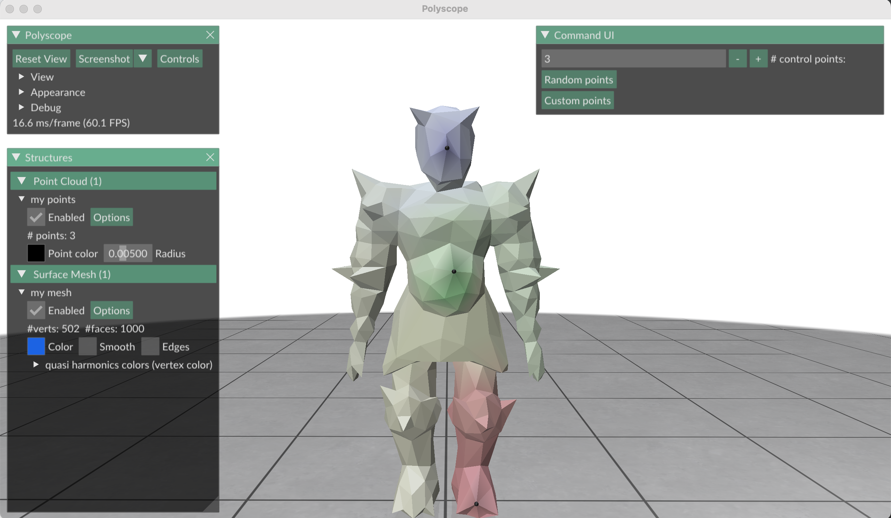

**About**
\
This is a python implementation of the paper Fast Quasi-Harmonic Weights for Geometric Data Interpolation by Yu Wang and Justin Solomon.

**Dependenices**
\
numpy, libigl, polyscope, tqdm, scipy, scikit-sparse, autograd 

**Usage**
\
python ./main.py [filename]

In the polyscope UI, input the number of control points. 
Press the "Random points" button to randomly generate the control points. 
\
To choose the control points, press the "Custom points" button. Select vertices 
on the mesh. 

Once all control points have been selected, 
the progress of the optimization will be displayed on the terminal

**Implementation**
1. Initialize theta, parametrization of the anisotropic tensor field A
2. Predict the unknown weights U using A
3. Minimize the biharmonic smoothness energy using ADAM optimization

**Future work**
1. This implementation uses dense matrices. I plan to use sparse matrices to increase the speed
2. In the current implementation, each control handle has 1 vertex. I wish to extend it so that for each control handle, 
the number of associated vertices can be varied.